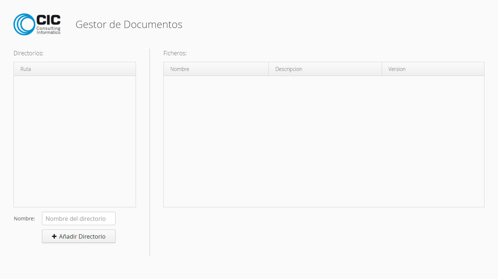
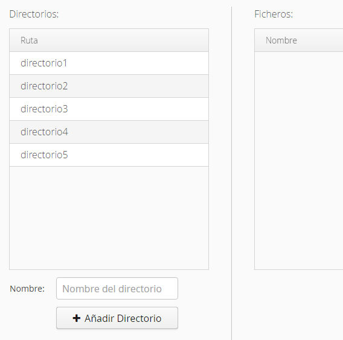
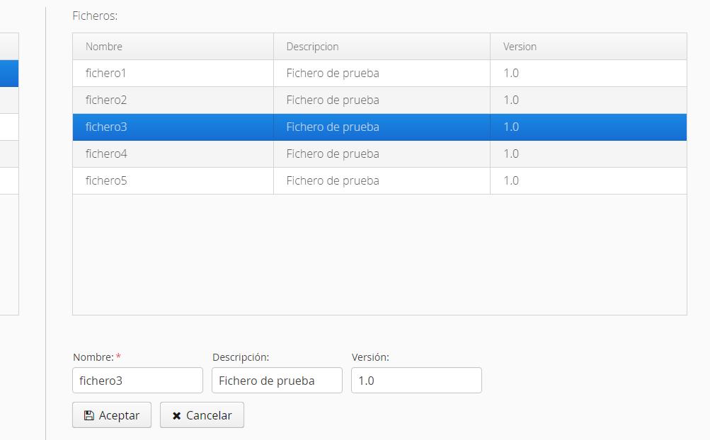

# GESTOR DE DOCUMENTOS

Autores:

+ José María Cagigas
+ José Francisco Martín

## 1. Introducción

Se ha planteado desarrollar el prototipo de un software de gestión documental sencillo en forma de aplicación web, utilizando la tecnología Java (en conjunto con los *frameworks* Spring y Vaadin).

Un sistema de gestión de documentos es un software utilizado básicamente para gestionar documentos en un árbol de ficheros. La mayoría son capaces, entre otros, de llevar un registro de las diferentes versiones de cada documento así como de los usuarios responsables de su autoría, o de la gestión de permisos. Sin embargo, en nuestro caso, el sistema se limita a una gestión muy básica, reducida a la **creación, renombrado y eliminación de directorios y ficheros**.

El presente documento describe brevemente las funcionalidades del software y la interfaz de usuario utilizada en su cliente web.

## 2. Características de la estructura de directorios

Como se ha señalado en la Introducción, el software realiza una gestión básica de directorios y ficheros. A continuación se detallan sus principales características:

+ Existe un **directorio raíz** del que cuelgan todos directorios del sistema.
+ Sólo se permite un nivel de profundidad. Es decir, todos los directorios deben colgar del directorio raíz (no se permiten subdirectorios que cuelguen de otros directorios diferentes del raíz).
+ Los ficheros no pueden colgar del directorio raíz; deben hacerlo de un subdirectorio.
+ No se permite modificar un directorio si tiene ficheros colgando de él.
+ Si se elimina un directorio, se deben eliminar todos los ficheros que cuelguen de él.

Los cambios en la estructura de directorios se llevan a cabo en dos niveles diferentes: 1) *físico* y 2) *lógico*. Es decir, cada operación de creación/modificación/eliminación de ficheros y directorios no sólo se registra en BB.DD. (nivel lógico) sino que, además, la operación se efectúa físicamente en el árbol de directorios del servidor.

## 3. Interfaz web

En este apartado se decribe la interfaz web básica desde la que los usuarios pueden operar el software. La interfaz está dividida en dos secciones principales: 1) panel izquierdo, para la **gestión de directorios** y 2) panel derecho, para la **gestión de ficheros**.

### 3.1. Gestión de directorios

Esta sección está dominada por una tabla (*tabla A*) con los directorios registrados en el sistema. Incluye además un conjunto de componentes contextuales que permiten manipular los directorios:

+ `Añadir` un nuevo directorio, especificando su nombre (si no hay ninguno seleccionado en la tabla)
+ `Modificar` nombre de directorio (con un directorio seleccionado vacío)
+ `Eliminar` directorio (con un directorio seleccionado)
+ `Cancelar` selección (quita la selección de la tabla)

### 3.2. Gestión de ficheros

La sección desde la que se gestionan los ficheros está dominada por una tabla (*tabla B*) con los ficheros registrados en el sistema que cuelgan del directorio seleccionado en la *tabla A*.

Inicialmente, la *tabla B* se encuentra vacía. Sólo cuando se selecciona un directorio en *tabla A* se cargan en *tabla B* los ficheros que cuelgan del directorio seleccionado.

De forma análoga a lo que ocurre en la sección de directorios, esta sección incluye además un conjunto de componentes contextuales que permiten manipular los ficheros de un directorio:

+ `Añadir` un nuevo fichero (si no hay ninguno seleccionado en la tabla). Al pulsar este botón aparece un formulario con los siguientes campos:
	- `Nombre` del fichero (obligatorio)
	- `Descripción` opcional del fichero.
	- `Número de versión` opcional del fichero. Si no se especifica una, la versión de nuevos ficheros se establece por defecto como 1.0;
	- `Aceptar` cambios. Intenta crear un fichero a partir de los campos introducidos en el formulario.
	- `Cancelar`. Cierra el formulario sin añadir el nuevo fichero.
+ `Actualizar` fichero (con un fichero seleccionado en la tabla). Al pulsar este botón aparece de nuevo el formulario que permite modificar los campos del fichero.
+ `Eliminar` fichero (con un fichero seleccionado en la tabla).

## 4. Líneas de trabajo futuras

Sin salirnos del alcance del proyecto y contemplar funcionalidades adicionales, en este apartado apuntamos algunas líneas de trabajo futuras que permitirían perfeccionar el software en su estado actual.

En la sección 2 se comentó que el software gestiona un árbol de directorios a dos niveles a la vez: físico y lógico. Actualmente se asume que pueden llegar a darse desincronizaciones entre el sistema de directorios real (nivel físico) y los registros de BB.DD. (nivel lógico), pero se debería trabajar en mecanismos que, por una parte, **minimizasen los riesgos** de que se produzcan estas incoherencias y, por otra, que se encargasen de **comprobarlas y corregirlas** automáticamente cuando se produzcan.

En este sentido, y aunque no entraba como tal dentro de las funcionalidades requeridas inicialmente para el software; actualmente se crean ficheros vacíos (*dummy*) dentro del árbol de directorios. Cabría modificar este comportamiento y implementar la funcionalidad de que los usuarios pudiesen **subir efectivamente documentos desde un equipo local** y quedasen colgados del árbol de directorios del servidor.

Se ha procurado diseñar una interfaz de usuario lo más simple y amigable posible para el usuario. Aunque en líneas generales se está satisfecho con el resultado, se estima que podría **simplificarse aún más** sin perder funcionalidad (permitiendo al usuario modificar directamente datos sobre las tablas sin necesidad de utilizar formularios, por ejemplo).
